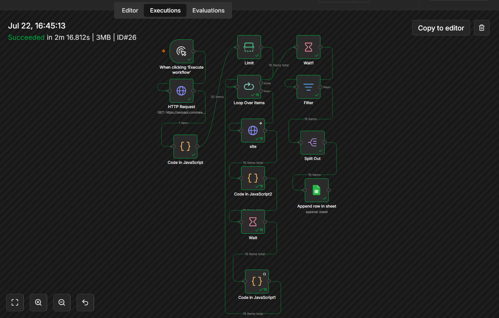
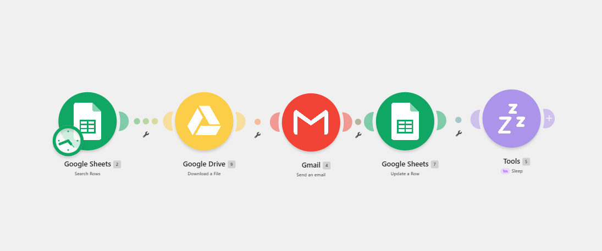
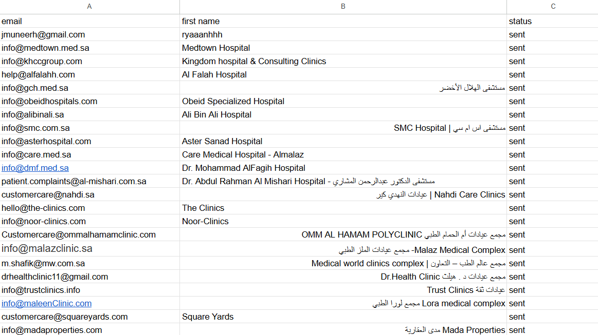

# job-application-automation
Automated job application workflow using n8n and Make.
# Job Application Automation

This project automates the job application process using n8n and Make.

## Features

- Search companies using Google Maps (SerpAPI)
- Visit company websites
- Extract company email addresses
- Save results to Google Sheets
- Send job application emails automatically
- Update application status

## Tech Stack

- n8n
- Make
- JavaScript
- Google Sheets
- Gmail
- SerpAPI

## Workflow

### n8n

### Make

### Google Sheets Output

